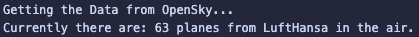

# Flights-Counter


## Super small script to just get the number of planes flying currently, by carrier

<hr>

### Functionality:

* Pull Data from the OpenSky API
* search through the results for an airline Tag (e.g. DLH)
* count up the flights currently in the Air

<hr>

### Quickstart

```bash
git clone https://github.com/Capetownvisitor/flights-counter.git
cd flights-counter

python -m venv .venv
# On Windows:
.\.venv\Scripts\activate
# On Mac/Linux:
source .venv/bin/activate

pip install -r requirements.txt
```

Run via:
```bash
python script.py 'XXX'
``` 
With 'XXX' -> Equal to a 3 Letter [Carrier Code](https://www.faa.gov/air_traffic/publications/atpubs/cnt_html/chap3_section_3.html)

#### Requirements:
* OpenSky Python API, from their Github [OpenSky API](https://github.com/openskynetwork/opensky-api)

<br>

* Tested Python Version: (3.12.12)

Output: 



<hr>

### Why this Project ?

I just did this very quick simple project because even though it is very simple, it has a fun usecase.
I also learnt a bit from it, like how to use the OpenSky API, "parse" the Data, put it all into a simple and easy script and package it into a small showcase Project complete with a README etc.
Also I do really enjoy Aviation and I enjoyed working even on this small micro Project. Hopefully there will be some more other Projects building on this one, or ones which are just in this Field of Aviation soon.

<hr>

### Possible future features

Realistic:
* More options to filter e.g. by Airport, Country etc

Fun, but probably out of Scope:
* adding a GUI
* adding a map feature
* run periodically and collect Data
* log Data into a Database
* Display Data in a nice visual

<hr>

### OpenSky:

Matthias Schäfer, Martin Strohmeier, Vincent Lenders, Ivan Martinovic and Matthias Wilhelm.
"Bringing Up OpenSky: A Large-scale ADS-B Sensor Network for Research".
In Proceedings of the 13th IEEE/ACM International Symposium on Information Processing in Sensor Networks (IPSN), pages 83-94, April 2014.

The OpenSky Network, https://opensky-network.org